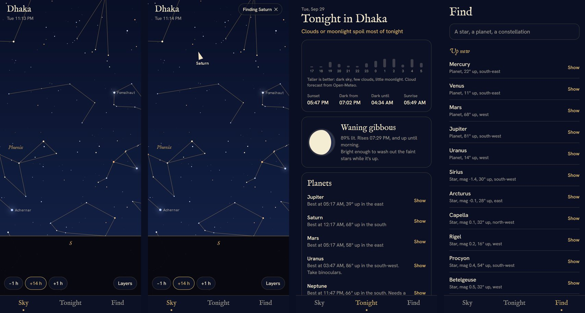
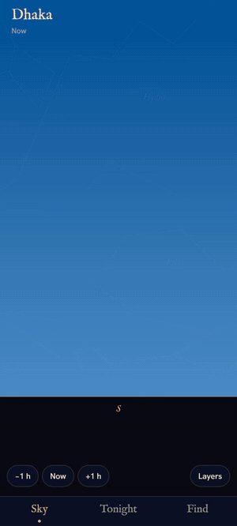

# Asterism

Hold your phone up to the night sky and it tells you what you're looking at.

Asterism works out where every star, planet and constellation is from where
you're standing, right now, and draws them over whatever your phone is
pointing at. Tap a light to find out what it is. Search for Saturn and an arrow
walks you to it, with a tap of the phone when you're on target. The Tonight
tab tells you whether it's worth going outside: when it gets properly dark,
how much the Moon and the clouds will spoil it, which planets are up, and when
the International Space Station will fly over.



<p align="center">
  
</p>

**[Watch it as a video](docs/demo.mp4)** (45 seconds): day turns to night,
Find leads the way to Saturn, night vision, and tonight's forecast.

- **The sky, live.** About 5,000 stars down to the faintest the eye can see,
  coloured by their temperature, the 88 constellations drawn the way old star
  atlases drew them, the Sun, the Moon in its real phase, the planets, and the
  space stations with the next few minutes of their path.
- **Point, drag or pinch.** The phone's motion sensors aim the view; drag to
  look around by hand, pinch to zoom, tap anything for its name, brightness,
  distance and when it rises and sets.
- **Travel in time.** Step the sky hours or days forward or back and watch it
  turn.
- **Tonight.** An hour-by-hour score from sunset to sunrise combining
  darkness, cloud cover and moonlight; the Moon's phase; each planet's best
  time and direction; visible space-station passes, with a reminder five
  minutes before.
- **Night vision.** One switch turns every colour a dim red, the way
  astronomers' torches are, so your eyes stay dark-adapted.
- **Works offline.** The sky is computed on the phone. Only the clouds and the
  satellites' orbits come from the network, and both are cached.

## Try it

On your phone, install **Expo Go** (Google Play or the App Store). Then:

```bash
npm install
npx expo start
```

Scan the QR code it prints: with Expo Go on Android, with the Camera app on
iPhone. The phone and computer need to be on the same Wi-Fi; if they can't
see each other, `npx expo start --tunnel` goes through Expo's servers instead.

To install it like any other app, build an APK in the cloud with EAS (free
account at expo.dev):

```bash
npx eas-cli@latest build --platform android --profile preview
```

## How it works

### The sky, sixty times a second

Everything moving on screen is drawn with React Native Skia on the UI thread,
from Reanimated worklets, so the sky stays smooth even while the JavaScript
thread is busy.

Each star is stored once as a unit vector in the equatorial frame (fixed on
the sky), precessed from the catalogue's epoch to today. Every frame, one 3x3
matrix is built: the Earth's rotation (local sidereal time) and the observer's
latitude take the equatorial frame to East-North-Up, and the phone's
orientation takes East-North-Up to the screen. Placing a star is then nine
multiplications and a division, with no trigonometry, so all 5,000 are
projected in well under a millisecond. Stars are walked brightest first, so the
loop stops at the faintest magnitude the sky allows: fewer in twilight, none
in daylight, and on opening the stars appear brightest first, the way eyes
adjust to the dark.

### Where the phone is pointing

Orientation comes from Reanimated's rotation sensor: Android's rotation
vector, which fuses gyroscope, accelerometer and magnetometer and is
referenced to magnetic north, and on iOS Core Motion's true-north frame.
Reanimated reorders Android's quaternion to match iOS, and `deviceToEnu`
undoes that to get a rotation from the phone's axes into East-North-Up. On
Android the magnetic declination at the observer's location is added so north
is true north. The quaternion is smoothed on the UI thread (a normalised
exponential blend, taking the short way round) to take out sensor jitter.
Compasses can be thrown off by nearby metal, so a correction can be dialled in
from the Layers panel.

### The astronomy

`src/astro` is written from the textbook, and tested against it:

| | Method | Accuracy |
| --- | --- | --- |
| Sidereal time, coordinates, precession, refraction | Meeus, *Astronomical Algorithms*, ch. 12, 13, 16, 21 | exact to the formulas |
| The Sun | Meeus ch. 25 | about 0.01° |
| The Moon | the main terms of Meeus ch. 47 (ELP-2000/82), with topocentric parallax | about 0.05° |
| The planets | JPL's Keplerian elements (Standish), Kepler's equation by Newton's method | a few arcminutes, 1800 to 2050 |
| Rise, set, twilight | stepped altitude search with bisection | about a second |
| Satellites | SGP4 on NORAD elements from CelesTrak, via satellite.js; Earth's shadow as a cylinder | as good as the elements |

The Moon's parallax matters here: seen from the ground rather than the Earth's
centre, the Moon sits up to a degree lower, two of its own widths, which would
be obvious held up against the real one.

A satellite pass is visible only when the satellite is in sunlight while the
observer's sky is dark, which is why the space stations appear at dusk and
dawn: lit by a Sun that has already set for you.

### Tonight's score

Each hour from sunset to sunrise gets a score: how dark the sky is (by the
Sun's depth below the horizon, through civil, nautical and astronomical
twilight), times the clear fraction of the sky from Open-Meteo's cloud
forecast, times a penalty for the Moon if it's up, scaled by how much of it is
lit (a thin crescent barely matters; a full Moon hides the faint stars). The
longest run of good hours is the best time to go out.

## Tests

```bash
npm test
```

The astronomy is checked against Meeus's worked examples: the Sun on 1992
October 13, the Moon on 1992 April 12, Venus on 1992 December 20, Venus seen
from Washington, the precession of θ Persei to 2028, Sputnik's launch as a
Julian day. Sunrise and sunset in Dhaka come out right on the equinox, a
Reykjavik midsummer night never gets fully dark, the ISS's passes are sane.
The frame-by-frame matrix is checked against the textbook coordinate
transform for real stars, and the planner against clear, overcast and moonlit
nights. CI runs these with lint, the type checker, `expo-doctor` and a full
web build.

## Credits

Stars and constellations: [d3-celestial](https://github.com/ofrohn/d3-celestial)
by Olaf Frohn (BSD 3-Clause), from the Hipparcos catalogue. Orbits:
[CelesTrak](https://celestrak.org). Clouds: [Open-Meteo](https://open-meteo.com).
Type: IM Fell English (Igino Marini's revival of the Fell types, cut in the
1670s) and Hanken Grotesk, both under the SIL Open Font License.

`npm run catalog` rebuilds `src/data/sky.json` from d3-celestial.

MIT licensed; see [LICENSE](LICENSE).
